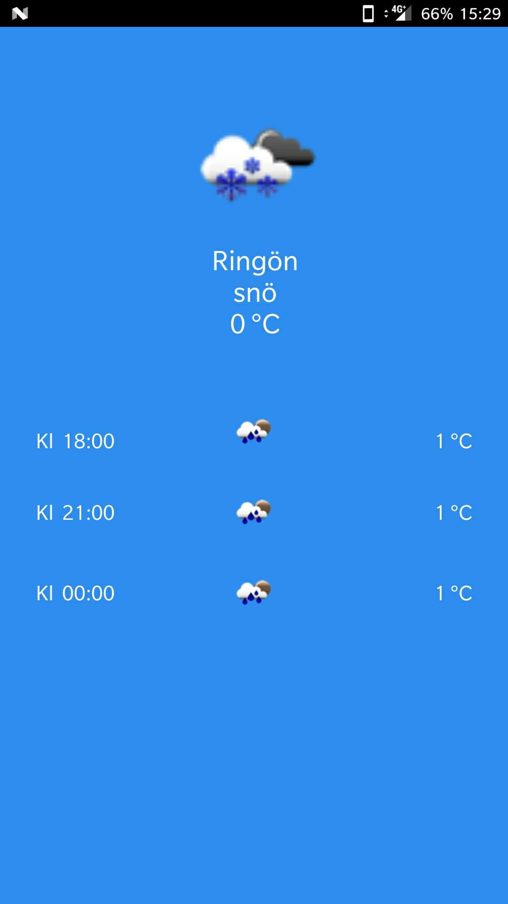
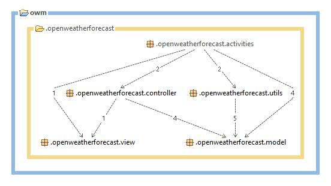

# OpenWeatherForecast
An assignment I was given to do before an interview. The task was to communicate with [Open Weather](https://openweathermap.org/) API and output some data.

## Description
Weather forecast application for Android. Make sure your phone is running Android Nougat with min SDK 24. Turn on 4G or Wifi in order to run application, preferably with GPS location on in order to find your position. Default location is Stockholm.

## GUI

## Dependencies

